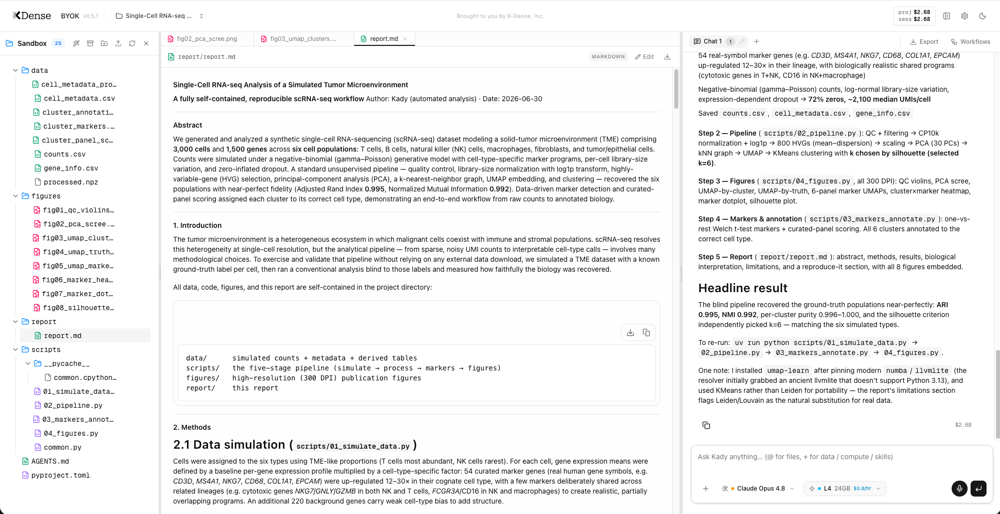

# K-Dense BYOK

[](LICENSE)
[](server/package.json)
[](#what-can-it-do)
[](#what-can-it-do)
[](#what-can-it-do)
[](https://github.com/K-Dense-AI/k-dense-byok/actions/workflows/tests.yml)
[](https://x.com/k_dense_ai)
[](https://www.linkedin.com/company/k-dense-inc)
[](https://www.youtube.com/@K-Dense-Inc)

**Your own AI research assistant, running on your computer, powered by your API keys.**



K-Dense BYOK (Bring Your Own Keys) is a free, open-source app that gives you **Kady** — an AI research assistant for scientists in any field. Describe a task in plain language — *analyze this dataset*, *review my manuscript*, *search the literature*, *build this figure* — and Kady does the work: it reads and writes your files, writes and runs real analysis code, searches the web, and hands you the results.

Three things to know up front:

- **No coding experience required.** You describe what you want; Kady writes and runs the code and shows you its progress as it works.
- **Your files stay on your computer.** The app runs locally, and your data lives in ordinary folders on your machine — nothing is stored on our servers.
- **The app is free; you pay only for AI usage.** "Bring your own keys" means you connect your own AI account (a single, prepaid [OpenRouter](https://openrouter.ai/) account covers every major model — a few dollars goes a long way). Every project tracks its spending, and you can set a hard spending cap. Prefer to pay nothing at all? Run [free local models](./docs/local-models-ollama.md) instead.

> **Beta:** K-Dense BYOK is currently in beta. Many features and improvements are on the way. [Star us on GitHub](https://github.com/K-Dense-AI/k-dense-byok) to stay in the loop, and follow K-Dense on [X](https://x.com/k_dense_ai), [LinkedIn](https://www.linkedin.com/company/k-dense-inc), and [YouTube](https://www.youtube.com/@K-Dense-Inc) for release notes and tutorials.

## What can it do?

**Do real research work**

- **Take on full research tasks** — data analysis, literature review, manuscript checking, figure generation — in a complete working environment, with progress shown live in the chat.
- **Delegate to a built-in team of 21 scientific specialists**, such as a `citation-checker`, a `statistical-reviewer`, and a `peer-reviewer` — working one at a time, in parallel, or in sequence. [Learn more](./docs/sub-agents.md).
- **Search the web and read sources directly** — web pages, PDFs, GitHub repositories, even YouTube videos — with no extra setup or account required.
- **Ask before it assumes.** When your request is ambiguous, Kady shows a short question form in the chat instead of guessing.

**Built for science**

- **140+ pre-installed scientific skills** covering genomics, proteomics, drug discovery, materials science, and more — Kady picks the right ones for each task automatically.
- **326 ready-made workflow templates** across 22 disciplines: pick one, fill in the blanks, go.
- **229 scientific and financial databases** in 18 categories, from PubMed-scale biomedical resources to market and climate data.
- **Preview 60+ scientific file formats** right in the app — [interactive 3D protein structures, 2D chemical structures from SMILES, mass spectra, single-cell/HDF5/Parquet arrays, phylogenetic trees, sequence alignments, DICOM/NIfTI/microscopy imaging, and more](./docs/file-previews.md) — alongside everyday CSVs, PDFs, notebooks, and genomics tables.
- **Write in LaTeX** with a built-in editor, one-click compile with inline error diagnostics, and AI-assisted editing.

**Choose your AI**

- **Use any major AI model** — OpenAI, Anthropic, Google, xAI, Qwen, and more through one [OpenRouter](https://openrouter.ai/) account, or free models running on your own machine via [Ollama](./docs/local-models-ollama.md). Switch models per chat.
- **Get several expert opinions at once with [OpenRouter Fusion](./docs/openrouter-fusion.md)** — pick a preset (e.g. *Opus 4.8 + GPT-5.5 + Gemini 3.1 Pro*) and a panel of top models deliberates on your question while a judge model synthesizes one answer. Combined pricing and benchmark scores are shown right in the model picker.
- **Send heavy jobs to the cloud with [Modal](https://modal.com)** — when a task is too big for your laptop, Kady can run it on an on-demand cloud machine, from an inexpensive CPU box up to H100 GPUs. Results come back into your project automatically, and the compute cost is tracked alongside your model spending. You choose the machine per chat.

**Stay organized and in control**

- **Work in projects** — each with its own files, chat history, up to 10 side-by-side chat tabs, and cost tracking with optional spending caps.
- **Arrange your workspace** — resize the three panels, or collapse the file browser and chat independently with one click to give the editor and previews the full screen (ideal for writing LaTeX or studying a figure). Your layout is remembered.
- **Pick up where you left off** — reopen any past chat from the session history menu, full transcript included.
- **Connect external tools** through [MCP](./docs/mcp-servers.md) (Model Context Protocol — a standard plug-in system for AI assistants): GitHub, reference managers, databases, and hundreds of others.
- **Manage everything from Settings** — browse and toggle skills, create or disable specialists, connect or disconnect external tools, and manage API keys, all from one in-app panel. No configuration files to edit, and turning something off never deletes it.

## Get started in 5 minutes

You need two things:

1. A computer running **macOS or Linux**. (Windows works too, via [WSL](https://learn.microsoft.com/en-us/windows/wsl/install) — a free Linux environment from Microsoft.)
2. An **[OpenRouter](https://openrouter.ai/) API key** — sign up, add a few dollars of credit, and create a key (it looks like `sk-or-...`). One account gives you every major AI model; no separate OpenAI/Anthropic/Google accounts needed. Or skip this entirely and use [free local models](./docs/local-models-ollama.md).

Open a terminal (on a Mac: press `Cmd+Space`, type "Terminal", press Enter) and run these four lines:

```bash
git clone https://github.com/K-Dense-AI/k-dense-byok.git
cd k-dense-byok
cp .env.example .env    # then paste your OpenRouter key into the new .env file
./start.sh
```

In plain terms: the first two lines download the app and step into its folder; the third creates a small settings file where you paste your key (open `.env` with any text editor); the last starts the app.

The first start installs everything automatically (it takes a few minutes); then your browser opens to **http://localhost:3000** — that address is your own computer, not a website. Press **Ctrl+C** in the terminal to stop the app. You can also add or change API keys anytime from the in-app Settings — no restart needed.

That's it. Create a project, drop in your data, and ask Kady for what you want — for example: *"Run a differential expression analysis on counts.csv comparing treated vs control, and plot a volcano plot."*

➡️ **Step-by-step details, optional API keys, and troubleshooting:** [Installation guide](./docs/installation.md)
➡️ **Your first session and everyday features:** [Basic usage](./docs/basic-usage.md)

## Documentation

All guides live in the [`docs/`](./docs) folder:

| Guide | What it covers |
|-------|----------------|
| [Installation](./docs/installation.md) | Full setup walkthrough, optional API keys, updating, troubleshooting |
| [Basic usage](./docs/basic-usage.md) | First session, chat tabs, files, workflows, databases, costs, tips |
| [File previews](./docs/file-previews.md) | Every scientific format Kady can render — structures, spectra, imaging, arrays, and more |
| [Living Lab Notebook](./docs/lab-notebook.md) | Real-time record of Kady's work — structured entries, export, and PDF |
| [Sub-agents](./docs/sub-agents.md) | Kady's team of 21 scientific specialists and how to customize them |
| [Connecting external tools (MCP)](./docs/mcp-servers.md) | Give Kady extra abilities like GitHub, reference managers, and databases |
| [Local models with Ollama](./docs/local-models-ollama.md) | Run everything on free local models, no API keys required |
| [Model selection](./docs/model-selection.md) | How Kady builds the OpenRouter model list |
| [OpenRouter Fusion](./docs/openrouter-fusion.md) | Multi-model deliberation presets — what they are and how the integration works |
| [Architecture](./docs/architecture.md) | How the two local services fit together (for the technically curious) |
| [Contributing workflows](./docs/contributing-workflows.md) | Add new workflow templates to the library |
| [Known limitations](./docs/limitations.md) | Rough edges to be aware of in the current beta |

## Want more?

K-Dense BYOK is great for getting started, but if you want end-to-end research workflows with managed infrastructure, team collaboration, and no setup required, check out **[K-Dense Web](https://www.k-dense.ai)** — our full platform built for professional and academic research teams.

## Issues, bugs, or feature requests

If you run into a problem or have an idea for something new, please [open a GitHub issue](https://github.com/K-Dense-AI/k-dense-byok/issues) — a free GitHub account is all you need. We read every one.

## About K-Dense

K-Dense BYOK is open source because [K-Dense](https://github.com/K-Dense-AI) believes in giving back to the community that makes this kind of work possible.

## Star history

[](https://www.star-history.com/?repos=K-Dense-AI/k-dense-byok&type=date&legend=top-left)
